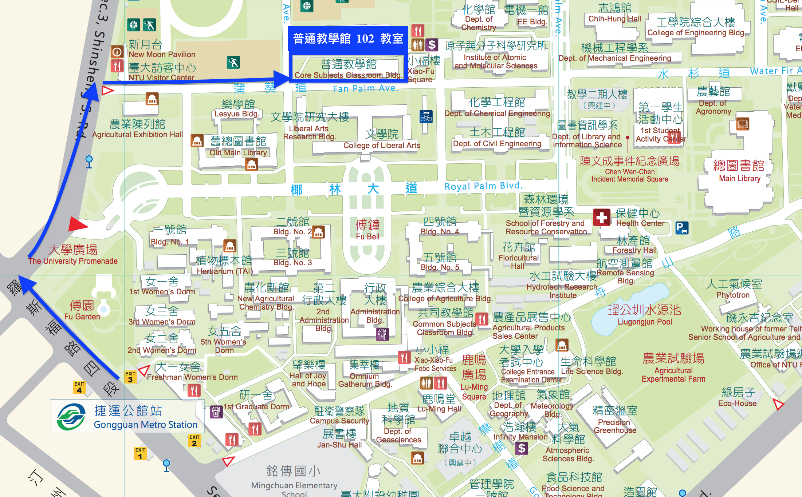

在科技與社群媒體的交互影響之下，文本資料的產生、散播與收集變得較以往便利而有效率，而文本分析的需求提高，其作法與樣貌也與過往有所不同，利用語料庫做語言研究與計算應用早已是時勢所趨。    

隨著研究議題的多元化與數據增加，**學習如何使用程式來處理研究語料，甚而使用程式來處理語料、建立個人語料庫並開放、釋出讓人永續使用**，對語言工作者與NLP工程師而言亦是重要的訓練之一。在此背景下，我們舉辦這個工作坊，邀請有興趣的朋友一起來參加學習。    

<br/>  

> 本工作坊的目的是為有 Python 入門知識的人提供一組語料庫程式處理的專門程式技能。  

<br/> 

---
## 本屆工作坊課程介紹

2018 第一屆語料庫程式實務工作坊從網路文本資料蒐集、文本分析到線上發佈個人語料庫，並以現場實作方式協助參加者完成建置，課程結束後亦公開課程資料於 Github 上。  


在此基礎上 2020 第二屆語料庫程式實務工作坊將帶領大家從已有的實際語料出發，介紹中文自動化標記、創建語料庫索引、利用現有資源建立自有語料庫、分享語料庫研究相關專案與應用。    
  


  

<h3 id="schedule">課程安排</h3>
<table style="width: 100%;">
    <colgroup>
       <col span="1" style="width: 20%;">
       <col span="1" style="width: 50%;">
       <col span="1" style="width: 30%;">
    </colgroup> 
    <thead style="background-color:#008476; color:white;">
        <tr>
            <th colspan="3"> DAY 1 |      12 月 12 日（六） </th>
        </tr>
    </thead>
    <tbody>
        <tr style="font-weight: bold;">
            <td>時間</td>
            <td>課程/活動</td>
            <td>講師</td>
        </tr>
        <tr style="background-color:rgba(247, 246, 238, 0.6)">
            <td>08:50 ~ 09:10</td>
            <td colspan="2">報到 & 入場</td>
        </tr>
        <tr>
            <td>09:10 ~ 10:10</td>
            <td>開幕</td>
            <td>謝舒凱</td>
        </tr>
        <tr>
            <td>10:20 ~ 12:10</td>
            <td>刀工備料：CoreNLP與自動詞意標記</td>
            <td>曾昱翔</td>
        </tr>
        <tr style="background-color:rgba(247, 246, 238, 0.6)">
            <td>12:10 ~ 13:30</td>
            <td colspan="2">用餐時間</td>
        </tr>
        <tr>
            <td>13:30 ~ 15:00</td>
            <td>小農手作：語料庫索引與建置(I)</td>
            <td>洪漢唐、江琼玉</td>
        </tr>
        <tr style="background-color:rgba(247, 246, 238, 0.6)">
            <td>15:00 ~ 15:30</td>
            <td colspan="2"> Coffee Break</td>
        </tr>
        <tr>
            <td>15:30 ~ 17:00</td>
            <td>小農手作：語料庫索引與建置(II)</td>
            <td>洪漢唐、江琼玉</td>
        </tr>
        <tr style="border:0">
            <td style="border:0" colspan="3">  </td>
        </tr>
    </tbody>
    <thead style="background-color:#008476; color:white;">
        <tr>
            <th colspan="3"> DAY 2 |      12 月 13 日（日） </th>
        </tr>
    </thead>
    <tbody>
        <tr style="font-weight: bold;">
            <td>時間</td>
            <td>課程/活動</td>
            <td>講師</td>
        </tr>
        <tr>
            <td>09:00 ~ 11:00</td>
            <td>獨家食譜：NLP + 語料庫語言學的應用分享</td>
            <td>謝吉隆、藍景彥、謝舒凱</td>
        </tr>
        <tr>
            <td>11:20 ~ 12:10</td>
            <td>上市揀材：PTT語料庫介紹</td>
            <td>許家誠、廖聿鋆</td>
        </tr>
        <tr style="background-color:rgba(247, 246, 238, 0.6)">
            <td>12:10 ~ 13:30</td>
            <td colspan="2">用餐時間</td>
        </tr>
        <tr>
            <td>13:30 ~ 15:00</td>
            <td>擺盤上菜：語料庫專案分享(I)</td>
            <td>王伯雅、古貿昌、石晴方、廖永賦、陳蓓怡</td>
        </tr>
        <tr style="background-color:rgba(247, 246, 238, 0.6)">
            <td>15:00 ~ 15:30</td>
            <td colspan="2"> Coffee Break</td>
        </tr>
        <tr>
            <td>15:30 ~ 17:00</td>
            <td>擺盤上菜：語料庫專案分享(II)</td>
            <td>王伯雅、古貿昌、石晴方、廖永賦、陳蓓怡</td>
        </tr>
        <tr style="background-color:rgba(247, 246, 238, 0.6)">
            <td>17:00 ~ 17:10</td>
            <td colspan="2">閉幕</td>
        </tr>
    </tbody>
</table>

<h3 id="speakers"> 講師簡介 </h3>
<div >
<h4> Day 1  講師</h4>
<table style="width: 100%; border: none;">
    <tr>
        <th style="background-color:#aad39c"><a href="https://lope.linguistics.ntu.edu.tw/"> 謝舒凱 </a> </th>
        <td>國立台灣大學語言學研究所副教授兼所長、 LOPE 實驗室主持人
            </td>
        </tr>
    <tr>
        <th style="background-color:#aad39c "> 曾昱翔 </th>
        <td>國立台灣大學語言學研究所博士後研究人員、 LOPE 實驗室成員
            </td>
        </tr>
    <tr>
        <th style="background-color:#aad39c "> 洪漢唐 </th>
        <td>國立台灣大學語言學研究所碩士生、 LOPE 實驗室成員、PTT 語料庫維護團隊
            </td>
        </tr>
    <tr>
        <th style="background-color:#aad39c "> 江琼玉 </th>
        <td>國立台灣大學語言學研究所研究助理、 LOPE 實驗室成員
            </td>
        </tr>
    </table>
</div>
</br>
<div>
<h4> Day 2  講師</h4>
<table style="width: 100%; border: none;">
    <tr>
        <th style="background-color:#aad39c;"><a href="https://sites.google.com/view/remixedlab/?fbclid=IwAR1tLUoGcjJb__s04C2q_U34IJLN4V9xvatGd5E2VXFKlGA6jR1j7ZsowAo"> 謝吉隆 </a></th>
        <td>國立台灣大學新聞研究所副教授、News & Media Lab 主持人
            </td>
        </tr>
    <tr>
        <th style="background-color:#aad39c;"> 藍景彥 </th>
        <td> 2020 法律科技黑客松得獎者
            </td>
        </tr>
    <tr>
        <th style="background-color:#aad39c;"> 許家誠 </th>
        <td>國立台灣大學語言學研究所碩士生、 LOPE 實驗室成員、PTT 語料庫維護團隊</td>
        </tr>
    <tr>
        <th style="background-color:#aad39c;"> 廖聿鋆 </th>
        <td>國立台灣大學語言學研究所碩士生、 LOPE 實驗室成員、PTT 語料庫維護團隊</td>
        </tr>
    <tr>
        <th style="background-color:#aad39c;"> 王伯雅 </th>
        <td>國立台灣大學語言學研究所博士生、 LOPE 實驗室成員</td>
        </tr>
    <tr>
        <th style="background-color:#aad39c;"> 古貿昌 </th>
        <td>國立台灣大學語言學研究所博士生、 LOPE 實驗室成員</td>
        </tr>
    <tr>
        <th style="background-color:#aad39c;"> 石晴方 </th>
        <td>國立台灣大學語言學研究所碩士生、 LOPE 實驗室成員</td>
        </tr>
    <tr>
        <th style="background-color:#aad39c;"> 廖永賦 </th>
        <td>國立台灣大學語言學研究所碩士生、 LOPE 實驗室成員</td>
        </tr>
    <tr>
        <th style="background-color:#aad39c;"> 陳蓓怡 </th>
        <td>國立台灣大學語言學研究所碩士生、 LOPE 實驗室成員</td>
        </tr>
    </table>
</div>


<h3 id="location"> 活動會場 </h3>
國立臺灣大學普通教學館 102 教室 （ [用 google map 規劃路線](https://goo.gl/maps/TBNMXgh4zCWqAApYA) ）

<a href="https://lopentu.github.io/Hands-on_Corpus_Linguistics/images/ntumap2020.png" target="_blank" title="點擊可放大圖片"></a>

<h3 id="registration"> 報名資訊 </h3>
- 人數限制：80 人 

- 報名資格：參加者須具備 Python 程式能力

- 報名期間：即日起至 2020 年 12 月 4 日（額滿截止）

- 報名費用：免費參加（由台大文學院人文創化計畫補助）

- 報名方式：請填寫 [Hocor 2020 報名表單](https://forms.gle/f326Yb5Jxpcr9FwV8)  
        ``` >> 注意：主辦單位每週五會統一寄發報名錄取通知，收到該通知方為報名成功。 ```
 
### 主辦單位
國立臺灣大學語言學研究所  
知識本體語言處理人文計算實驗室  

### 協辦單位
國立臺灣大學文學院人文創新與全球化研究中心  


---
## 相關連結
- [第一屆語料庫程式實務工作坊(Hocor2018)](http://lope.linguistics.ntu.edu.tw/hocor2018/)
- [人文學群的 Python 程式入門](https://lopentu.github.io/PythonForHumanities/)
- [LOPEN 計劃](https://lopen.linguistics.ntu.edu.tw/)
- [PTT 語料庫](http://140.112.147.132:9898/)

